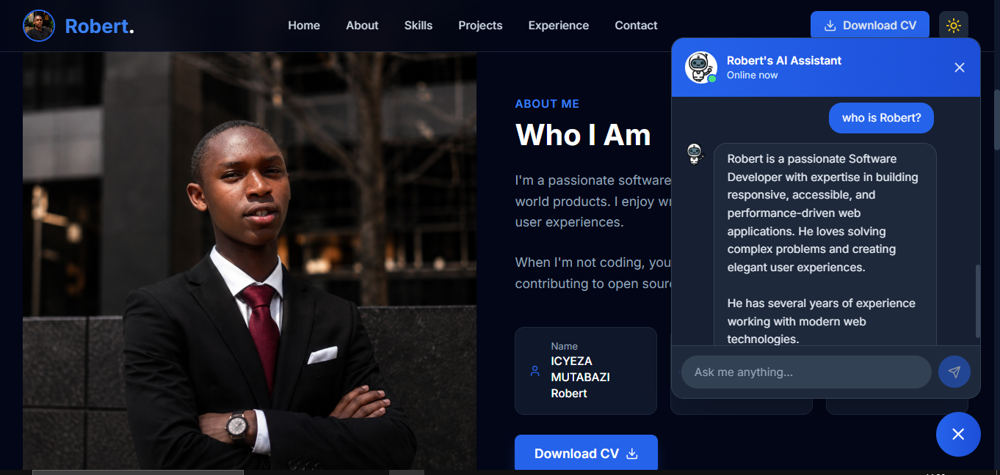

# 🚀 Icyeza Mutabazi Robert - Portfolio

Welcome to my personal portfolio! This is a modern, responsive web application built to showcase my skills, projects, and experience as a Software Developer. 

🔗 **Live Demo:** [Insert your deployed link here, e.g.,https://icyezamutabazirobert.netlify.app/]

 <!-- Replace with a screenshot of your site -->

---

## ✨ Features

- 🤖 **AI Assistant:** An interactive chatbot that answers questions about my skills, experience, and projects in real-time.
- 📄 **One-Click CV Download:** Visitors can easily download my resume directly from the site.
- 📱 **Fully Responsive:** Optimized for mobile, tablet, and desktop screens.
- 🌙 **Dark/Light Mode:** Seamless theme switching for better user experience.
- ⚡ **Fast Performance:** Built with Vite for lightning-fast load times and hot module replacement.
-  **Modern UI:** Clean, accessible, and professional design using Tailwind CSS.

---

## 🛠️ Tech Stack

- **Frontend Framework:** [Vue 3](https://vuejs.org/) (Composition API)
- **Build Tool:** [Vite](https://vitejs.dev/)
- **Styling:** [Tailwind CSS](https://tailwindcss.com/)
- **Icons:** [Lucide Vue Next](https://lucide.dev/)
- **PDF Generation:** [html2pdf.js](https://github.com/eKoopmans/html2pdf.js) (for CV download)

---

## 📦 Installation & Setup

To run this project locally, follow these steps:

1. **Clone the repository:**
   ```bash
   git clone https://github.com/Icyzea100/myPortfolio.git
   ## 📄 License

This project is open-source and available under the [MIT License](LICENSE).

---

<p align="center">
  Made with ❤️ by <strong>Icyeza Mutabazi Robert</strong>
</p>